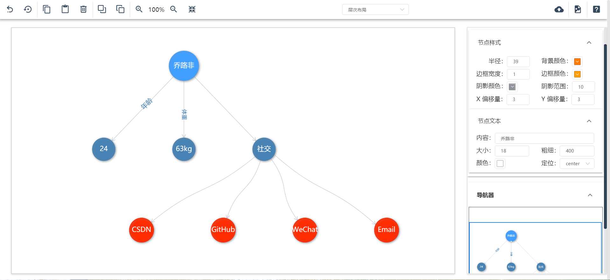

[English](README.en.md) | 简体中文

<h1 align="center">知识图谱编辑器(KG-Editor)</h1>
<div align="center">

基于 [Vue 2.x](https://cn.vuejs.org/v2/guide/) +  [G6 3.8](https://g6.antv.vision/zh)  + [Vuetify](https://vuetifyjs.com/en/) 的可视化知识图谱编辑器(KG-Editor)

</div>

## 效果截图



## 演示地址

<div align="center">

[KG-Editor](http://175.24.122.85:1030/#/)

</div>

## 功能介绍

- [x] 支持切换多种布局模式
- [x] 添加节点---双击画布空白处添加节点
- [x] 编辑节点---点击节点后可在右侧配置器进行编辑节点
- [x] 添加连线---鼠标移入节点后显示锚点，点击锚点后便作为起始节点，点击其它节点实现连线
- [x] 编辑连线---点击连线后可在右侧配置器进行编辑连线
- [x] 缩略图&emsp;---右侧导航器实现缩略图
- [x] 撤销功能(对节点和连线添加或者删除的撤销)
  - [x] 点击按钮撤销
  - [x] Ctrl + Z撤销
- [x] 重做功能
- [x] 复制节点功能
  - [x] 点击按钮复制
  - [x] Ctrl + C复制
- [x] 粘贴节点功能
  - [x] 点击按钮粘贴
  - [x] Ctrl + V粘贴
- [x] 删除节点、连线功能
  - [x] 点击按钮删除
  - [x] Ctrl + Backspace删除
- [x] 置于顶层功能
- [x] 置于底层功能
- [x] 放大画布功能
  - [x] 点击按钮放大
  - [x] 鼠标滚轮上滑
- [x] 缩小画布功能
  - [x] 点击按钮缩小
  - [x] 鼠标滚轮下滑
- [x] 适应画布
- [x] 上传数据文件生成知识图谱功能

```js
// 文件数据格式.txt
{
    "nodes":[
        {"id": "node1", "label": "luffy"},
        {"id": "node2", "label": "24岁"},
        {"id": "node3", "label": "62kg"}
    ],
    "edges":[
        {"source": "node1", "target": "node2", "label": "年龄"},
        {"source": "node1", "target": "node3", "label": "体重"}
    ]
}
```

- [x] 导出图片功能
- [x] 帮助

## 联系我

#### Email: luffy0101@163.com
#### 微信： 
